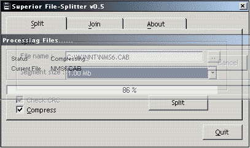



## Superior File Splitter v0\.5

### Description

Split file (with optional compression), Following code is used : CoolBorder, Encryption (to ini), Check if file exists, FileString Manipulation, ProgressBar Deluxe 1.01, Huffman Compression Class (by F.Q). Very low memory usage when splitting/joining files. See the about tab for additional Credits.
 
### More Info
 

             |
---                |---
**Submitted On**   |2001-05-22 09:56:34
**By**             |[rudz](https://github.com/Planet-Source-Code/PSCIndex/blob/master/ByAuthor/rudz.md)
**Level**          |Intermediate
**User Rating**    |5.0 (15 globes from 3 users)
**Compatibility**  |VB 6\.0
**Category**       |[Complete Applications](https://github.com/Planet-Source-Code/PSCIndex/blob/master/ByCategory/complete-applications__1-27.md)
**World**          |[Visual Basic](https://github.com/Planet-Source-Code/PSCIndex/blob/master/ByWorld/visual-basic.md)
**Archive File**   |[Superior F198925222001\.zip](https://github.com/Planet-Source-Code/rudz-superior-file-splitter-v0-5__1-23342/archive/master.zip)

